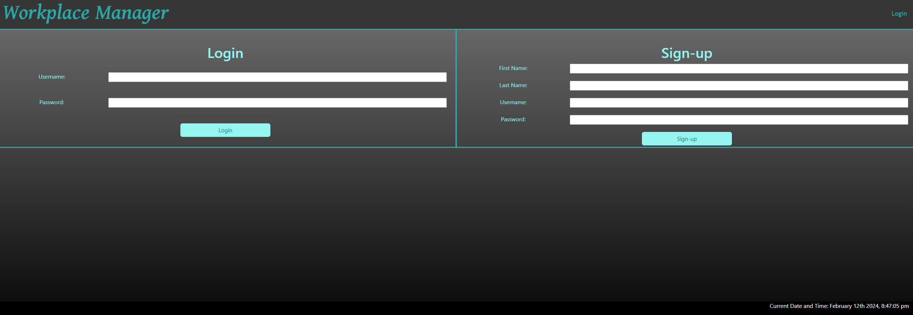
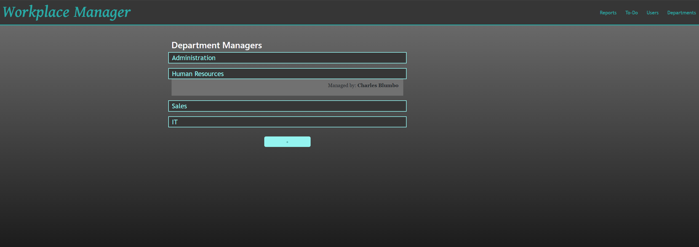
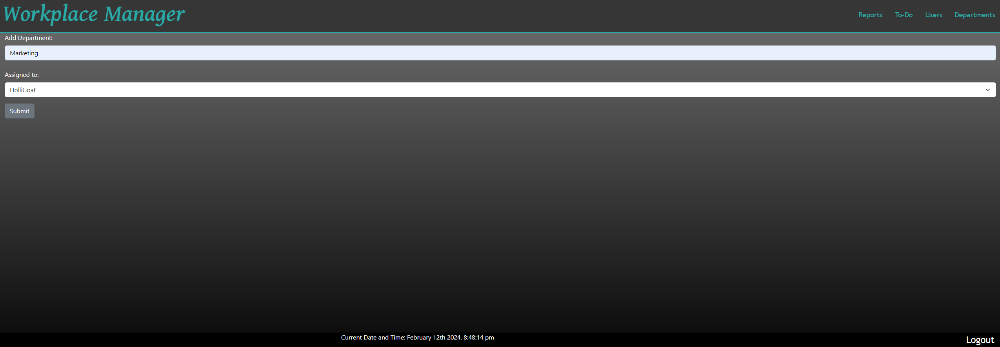
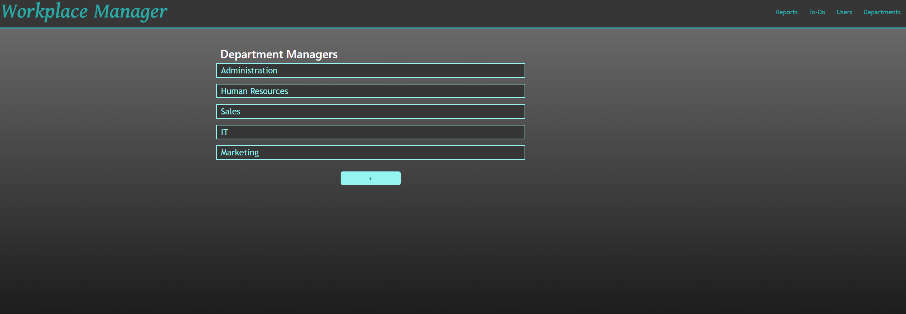

# Workplace Manager

https://workplace-management-app-ad243e4e571c.herokuapp.com/

## Description
The motive behind this application was to help solve a managing problem as an all in one platform to help add departments, add chores, add users, assign managers, and more. While working on this project there was a lot of things I learned along the way. Some being the following: 
* The importance of your seeds. This was very crucial in linking all the information to the departments. Knowing how to reference the seeds information on the front end was also a challenge on the handlebars part. .  
* How to properly test routes. I was in charge of making sure the routes worked with insomnia and the department handlebars. The good thing I didnt know that would help was how to read the information that was being sent as a request on insomnia would help get an idea of how to sort the handlebar in order to make sure the proper information would be called back. 

## Table of Contents
-[Descriptions](#Descriptions)
-[Installation](#Installation)
-[Usage](#Usage)
-[Credits](#Credits)
-[Tests](#Tests)
-[License](#License)
-[Questions](##Questions)

## Installation
In order to install this project you will have to clone the repository: 
    1. Create a place where you will want to store all this information 
    2. Once there open GitBash
    3. Clone this repository into the file you will have this stored in
            enter following: git@github.com:jamesbruckner/workplace_management_app.git
    4. Press enter to create your local clone

## Usage
This can be used to manage your team! 

## Credits
Credits to my amazing team. They helped tremendously in this project whenever I would get stuck. Check out their repos:
[Ophelia](https://github.com/MoonstruckOccultist)
[James](https://github.com/jamesbruckner)
[Lilly](https://github.com/lilyvander)

## Tests
N/A
## License
MIT

## Questions
If you have any questions or concerns feel free to reach out via the following:
GitHub:[juanthtgotaway](https://github.com/juanthtgotaway)